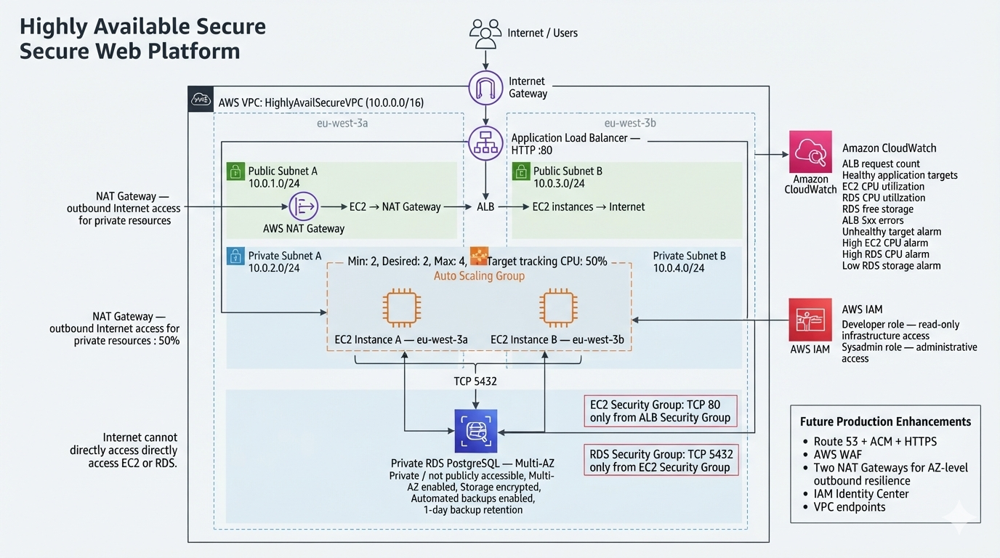
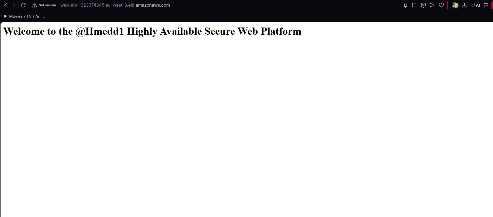
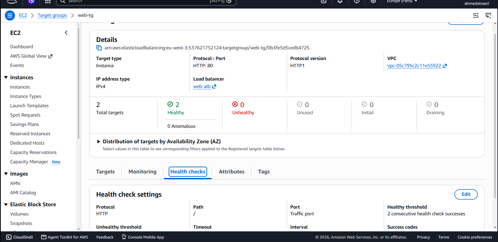
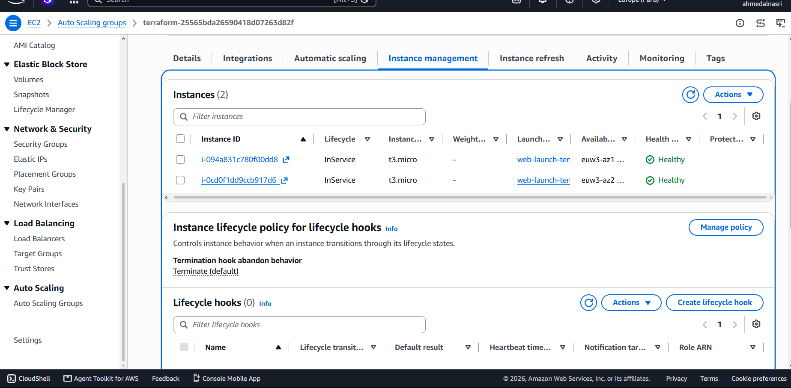
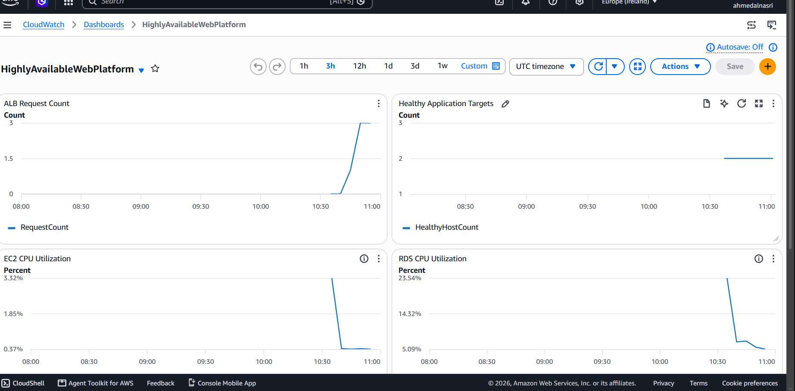
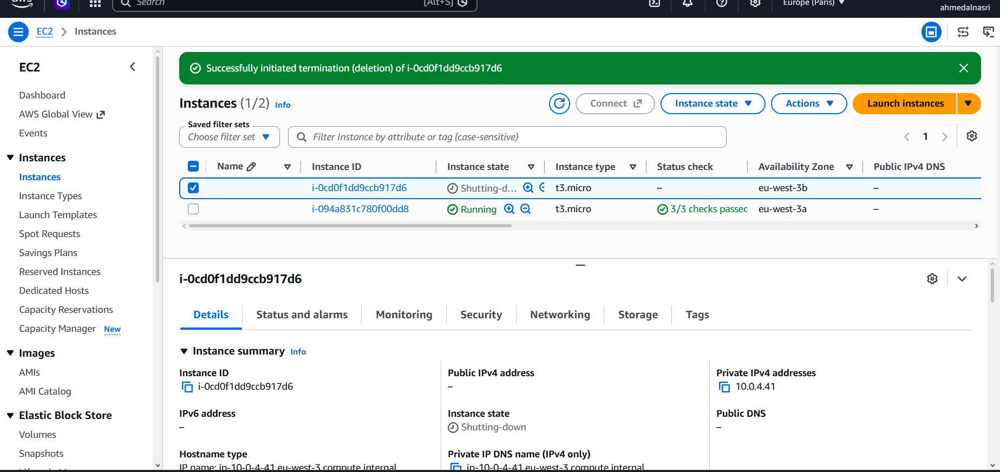
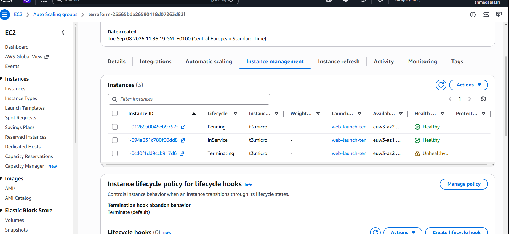

# Highly Available Secure Web Platform

An AWS project focused on Infrastructure as Code, client request analysis, and cloud infrastructure and architecture design.

## Introduction

This is an AWS project where you can practice **Infrastructure as Code (IaC)**, **client request analysis**, and **infrastructure & architecture design**.

It might be a long project, but it's worth it. Put on your favorite playlist and follow along.
if u dont have one check out mine :o **https://youtube.com/playlist?list=PLcAZ5Ag2UbfU&si=tp7oHjpEw8kGno8j**

One of the things I recommend is taking the **client request** from this project and giving it to an AI. Ask it to act as the client, answer your questions, and let you analyze the requirements yourself.

Then start building your own solution.

The most important thing is that you understand the **logic behind the decisions**:

* Why do we need this component?
* Why is it public or private?
* Why did we choose this architecture?
* What happens if something fails?
* How does the infrastructure scale?
* What security risks are we addressing?
* What are the cost trade-offs?

Once you understand the logic, the rest is mostly learning how to express those decisions in HCL and checking the Terraform/AWS documentation when you need to.

So, have fun, learn something, break things, fix them, and **GLHF! :)**

---

## Project Objective

The goal of this project is to take a real-world style client request and turn it into a working AWS infrastructure.

Instead of starting with Terraform and randomly creating AWS resources, the idea is to start with the client's needs and work from there.

The project focuses on:

* Client request analysis
* Requirements analysis
* AWS architecture design
* Infrastructure as Code with Terraform
* Security
* High availability
* Auto Scaling
* Private application infrastructure
* Database availability
* Monitoring
* Failure testing
* Cost and architecture trade-offs

The main goal is not to build the biggest infrastructure possible.

The goal is to understand **why each component exists and how everything works together**.

---

## Client Request

The project starts with a simulated client request.

The client needs a web application that is accessible from the Internet while keeping important infrastructure private and secure.

The application should also remain available if an application server fails, handle increases in traffic, provide controlled infrastructure access, and support data backup and recovery.

You can find the original client request here:

[Client Request](client/client-request.txt)

The requirements were then analyzed before designing the infrastructure:

[Requirements Analysis](docs/requirements-analysis.md)

---

## Architecture

The final architecture uses two Availability Zones with public and private subnets.



The main components are:

* Amazon VPC
* Two Availability Zones
* Public and private subnets
* Internet Gateway
* Application Load Balancer
* EC2 Auto Scaling Group
* NAT Gateway
* Private Amazon RDS PostgreSQL
* Security Groups
* IAM roles
* CloudWatch

The Application Load Balancer is the public entry point.

The application servers run in private subnets and are not directly exposed to the Internet.

The database is also private and only accepts traffic from the application layer.

The architecture was designed from the client requirements rather than choosing AWS services first.

---

## AWS Services

| Area                   | Services                                     |
| ---------------------- | -------------------------------------------- |
| Networking             | VPC, Subnets, Route Tables, Internet Gateway |
| Traffic                | Application Load Balancer, Target Group      |
| Compute                | EC2, Launch Template, Auto Scaling Group     |
| Database               | Amazon RDS PostgreSQL                        |
| Security               | Security Groups, IAM                         |
| Connectivity           | NAT Gateway                                  |
| Monitoring             | CloudWatch                                   |
| Infrastructure as Code | Terraform, HCL                               |

---

## Project Structure

```text
Highly-Available-Secure-Web-Platform/
│
├── architecture/
│
├── client/
│   └── client-request.txt
│
├── docs/
│   └── requirements-analysis.md
│
├── screenshots/
│   ├── 01-structure.png.jpg
│   ├── 02-application-working.png.png
│   ├── 03-healthy-targets.png.png
│   ├── 04-auto-scaling-group.png.png
│   ├── 05-cloudwatch-dashboard.png.png
│   ├── 06-failure-test-before.png.png
│   └── 08-failure-test-recovered.png.png
│
├── terraform/
│   ├── iam.tf
│   ├── main.tf
│   ├── monitoring.tf
│   ├── outputs.tf
│   ├── scaling.tf
│   └── iam/
│       └── developer-policy.json
│
├── .gitignore
└── README.md
```

---

## Deployment

The infrastructure is managed with Terraform.

The basic workflow is:

```bash
terraform init
terraform fmt
terraform validate
terraform plan
terraform apply
```

The Terraform configuration is located in the `terraform/` directory.

```bash
cd terraform
```

Then run the Terraform commands from there.

After deployment, Terraform provides useful outputs such as:

* Application Load Balancer DNS name
* VPC ID
* Availability Zones
* Auto Scaling Group name
* RDS endpoint
* NAT Gateway public IP
* IAM role ARNs

---

## Validation & Testing

After deployment, the infrastructure was tested to verify that the main requirements were working.

### Application

The application was successfully accessed through the public Application Load Balancer.



### Load Balancer Targets

The application instances were registered with the Target Group and reported as healthy.



### Auto Scaling Group

The Auto Scaling Group maintains the required application capacity and is configured with:

* Minimum: 2 instances
* Desired: 2 instances
* Maximum: 4 instances



### CloudWatch

CloudWatch was used to monitor important infrastructure metrics.



The dashboard includes:

* Application Load Balancer requests
* Healthy application targets
* EC2 CPU utilization
* RDS CPU utilization
* RDS free storage

### Failure Test

One application instance was terminated to test whether the Auto Scaling Group could recover the required capacity.

Before the test:



After recovery:



This test demonstrates the recovery behavior of the Auto Scaling Group when an application instance is lost.

---

## Security

Security was considered during the architecture design rather than added afterwards.

Some of the main decisions include:

* Application servers are placed in private subnets.
* The database is not publicly accessible.
* The Application Load Balancer is the public entry point.
* Security Groups control communication between the different layers.
* Developers receive read-only infrastructure permissions.
* A separate administrator role provides broader infrastructure access.
* RDS storage is encrypted.
* CloudWatch provides infrastructure monitoring.

The goal is to expose only what needs to be publicly reachable while keeping internal resources private.

---

## Architecture Trade-offs

This project is designed as a learning environment, so some decisions were made with cost and simplicity in mind.

For example:

* One NAT Gateway instead of one per Availability Zone
* HTTP instead of HTTPS because no custom domain was available
* Simplified IAM setup
* Short database backup retention for the lab environment

These choices are part of the engineering process.

The important part is understanding **what requirement the decision satisfies, what trade-off it introduces, and what could be changed in a production environment**.

---

## Limitations & Future Improvements

This project is not intended to represent a complete production environment.

Current limitations include:

* No custom domain
* HTTP instead of HTTPS
* One NAT Gateway
* Simplified IAM configuration
* Lab-oriented backup configuration

Possible future improvements include:

* Route 53
* AWS Certificate Manager
* HTTPS
* AWS WAF
* NAT Gateway per Availability Zone
* IAM Identity Center
* More advanced logging and monitoring
* CI/CD
* Improved secrets management
* More advanced backup and disaster recovery

These features are not presented as implemented because they are outside the current version of the project.

---

## Cleanup

AWS resources can generate costs, especially resources such as NAT Gateway, Application Load Balancer, and RDS.

When the project is no longer needed, the infrastructure can be destroyed with:

```bash
cd terraform

terraform plan -destroy
terraform destroy
```

Always review the destroy plan before confirming it.

---

## What This Project Teaches

The main thing I wanted to practice with this project was the process of going from a client request to working cloud infrastructure.

```text
Client Request
      ↓
Requirements Analysis
      ↓
Architecture Design
      ↓
Terraform Implementation
      ↓
Deployment
      ↓
Testing
      ↓
Failure & Recovery
      ↓
Documentation
```

The Terraform code is only one part of the project.

Understanding **why the infrastructure was designed this way** is the more important part.

The detailed requirements analysis explains this process in more depth:

[Requirements Analysis](docs/requirements-analysis.md)

---

## Final Thoughts

This project is intentionally not perfect or production-ready.

It is a learning project built around a realistic scenario, with the goal of understanding how to go from a client requirement to an actual cloud architecture and then implement that architecture using Infrastructure as Code.

The important part is understanding the decisions behind the infrastructure.

**GLHF! :)**
